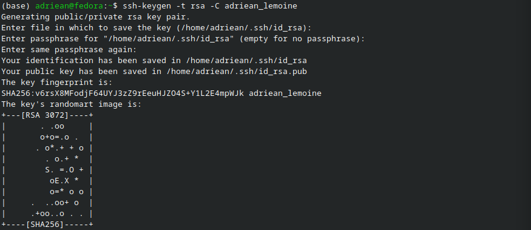

# Remote Access to Google Cloud VM

## Purpose

To access your Google Cloud VM from any device without navigating to the Google Cloud client in the web browser, by utilizing your terminal.

## Procedure: Connect to VM remotely

1. Open the terminal on your device.

2. Enter the following to generate a key pair utilizing the rsa protocol, utilizing your first and last name. When it asks for a file name, hit ENTER to use the default. When it asks for a passphrase, this can be skipped as well by hitting ENTER once more.

```bash
ssh-keygen -t rsa -C firstname_lastname
```



3. Navigate to your .ssh folder. This should be located at the root of your user folder on your device.
    Example: `/home/adriean/.ssh`
    
4. Open the file `id_rsa.pub` or use a command such as `cat` to print out the contents of the file. Copy all of the contents of this file. 


5. Navigate to the [Google Cloud console](https://console.cloud.google.com). Under 'Quick access', click *Compute Engine*. In the sidebar, click *VM instances*. Click on your instance name. 


6. Click *Edit* at the top. Scroll down to the section titled *Security and access*. Under SSH Keys, click the box that says *Add item* and paste your SSH key copied earlier into the text field. Then click *Save* at the bottom. Note that saving may take up to a minute.

7. You will be redirected back to your VM instances page. Copy the External IP listed for your environment.

8. In a terminal, use the following to connect to your VM. Type 'yes' on the first connection occurrance to confirm the connection.

```bash
ssh vm_username@external_ip
```


9. To exit the VM, use the command `exit`.

## Procedure: Create SSH nicknames

### Purpose

This is a way to create nicknames for your SSH connections, so you don't have to type out the full command and IP address every time.

1. Open or create the config file on your local computer, specifically located in the `.ssh` directory of your user home folder. 

2. Add connection details. The following is the format for each connection in this file:

```bash
Host <nickname>
    HostName <external IP address of remote connection>
    User <username on remote connection>
    Port 22
    IdentityFile <typically ~/.ssh/id_rsa>
```

3. Save and exit the file. Now, you can connect to the remote machine using the nickname such as:

```bash
ssh school_vm
```
